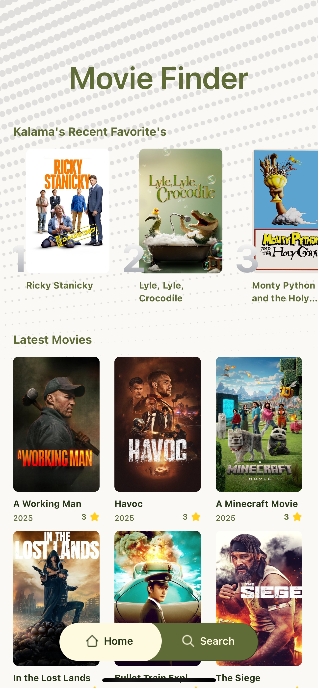
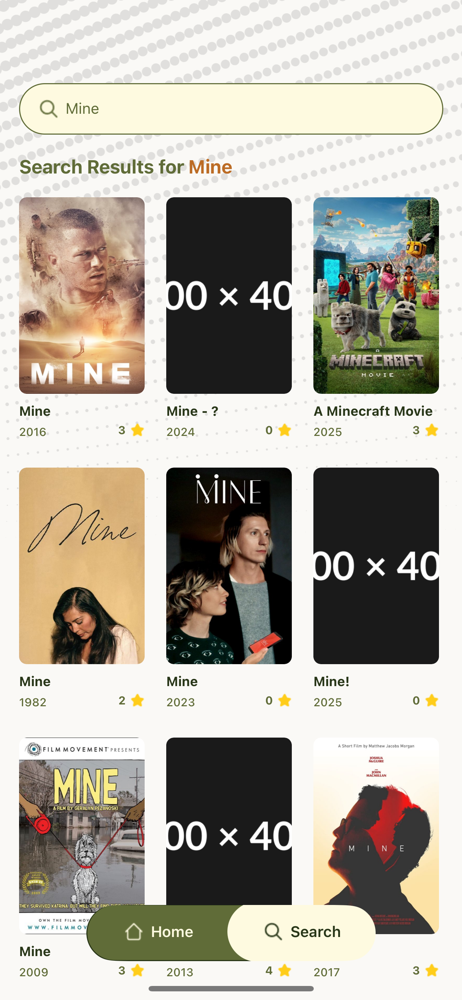

# 🎬 React Native Movie App

A visually appealing and performance-optimized movie app built with **React Native**, **Expo**, **TypeScript**, **React Query**, and **Tailwind CSS**. Browse the latest films, explore my top 5 featured picks, or search through the vast collection of movies using **The Movie Database (TMDb)** API.

---

## ✨ Features

- 🔍 **Search** for any movie using TMDb API
- 🆕 View **latest movies**
- 🌟 See **my top 5 featured movies**
- ⚡ Powered by **React Query** for seamless data fetching and caching
- 🎨 Styled with **Tailwind CSS** (via NativeWind)
- 🚀 Built with **Expo** for fast development and cross-platform support

---

## 🧰 Tech Stack

- **React Native + Expo**
- **TypeScript**
- **React Query** (TanStack)
- **Tailwind CSS** via NativeWind
- **TMDb API**
- **Axios** for API requests

---

## 📦 Installation

1. **Clone the repo**

   ```bash
   git clone https://github.com/your-username/react-native-movie-app.git
   cd react-native-movie-app
   ```

2. **Install dependencies**

   ```bash
   npm install
   ```

3. **Start the app**
   ```bash
   npm expo start
   ```

> Make sure you have the **Expo CLI** installed globally:

```bash
npm install -g expo-cli
```

---

## 🔐 API Key Setup

This app uses the **TMDb API**. Create a `.env` file in the root of your project and add your API key:

```env
TMDB_API_KEY=your_tmdb_api_key_here
```

Make sure to use your API key securely with something like `expo-constants` or a secure config.

---

## 📸 Screenshots

### 🏠 Home Screen



### :male_detective: Details Screen


### 🔍 Search Results Screen



---
